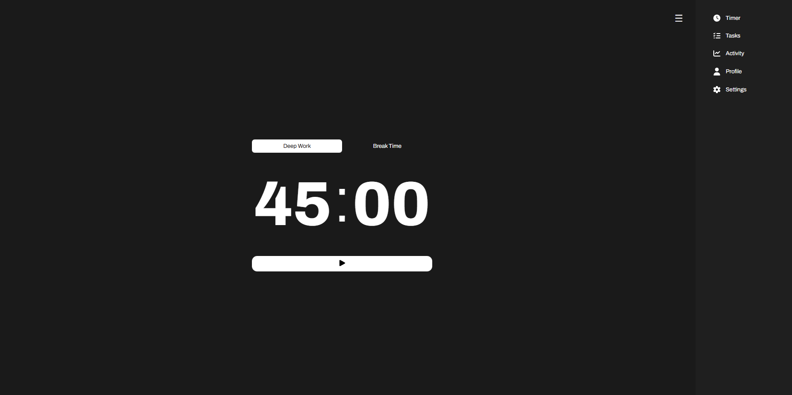

# Work-Space 🚀

A modern productivity application designed to help you manage your time effectively using the Pomodoro technique, track tasks, and monitor your work activity.

## 🌟 Features

- ✅ **Deep Work Timer** - Customizable focus sessions with break intervals
- ✅ **Task Management** - Add, complete, and track your daily tasks
- ✅ **Activity Tracking** - Monitor your deep work time, breaks, and completed tasks
- ✅ **Profile System** - User authentication and account management
- ✅ **Customizable Settings** - Adjust timer durations to fit your workflow
- ✅ **Responsive Design** - Works seamlessly on desktop and mobile devices
- ✅ **Modern UI** - Clean and intuitive interface with smooth animations

## 📸 Screenshots




## 🛠️ Technologies Used

- **HTML5** - Semantic markup
- **CSS3** - Modern styling with Flexbox/Grid
- **JavaScript (ES6+)** - Dynamic functionality and interactivity
- **Local Storage** - Data persistence
- **Font Awesome** - Icon library
- **Modular Architecture** - Organized code structure

## 📦 Installation

1. Clone the repository:
```bash
git clone https://github.com/ibrahimmdef/work-space.git
cd work-space
```

2. Open the project:
   - Simply open `src/timer.html` in your web browser
   - Or use a local development server:
```bash
# Using Python
python -m http.server 8000

# Using Node.js (http-server)
npx http-server
```

3. Navigate to:
```
http://localhost:8000/src/timer.html
```

## 📁 Project Structure

```
work-space/
├── public/              # Static assets (images, screenshots)
├── src/                 # HTML pages
│   ├── timer.html      # Timer/Pomodoro page
│   ├── task.html       # Task management page
│   ├── activity.html   # Activity statistics page
│   ├── profile.html    # User profile page
│   └── settings.html   # Settings and configuration
├── styles/             # CSS stylesheets
│   ├── timer.css
│   ├── tasks.css
│   ├── activity.css
│   ├── profile.css
│   └── settings.css
├── logic/              # JavaScript modules
│   ├── timer.js        # Timer functionality
│   ├── task.js         # Task management logic
│   ├── activity.js     # Activity tracking
│   └── profile.js      # Profile management
└── README.md           # Project documentation
```

## 🎯 Usage

### Timer Page
1. Choose between **Deep Work** or **Break Time** mode
2. Click the play button to start the timer
3. The timer will countdown and track your session
4. Use the refresh button to reset the current timer
5. Completed sessions are automatically logged to Activity

### Tasks Page
1. Enter a task in the input field
2. Click the "+" button or press Enter to add
3. Check off tasks as you complete them
4. View remaining task count at the bottom
5. Tasks are saved automatically

### Activity Page
- **All Stats**: View cumulative statistics
  - Total deep work time
  - Total break time
  - Total completed tasks
- **Today**: See your daily progress
  - Today's deep work time
  - Today's break time
  - Today's completed tasks

### Settings Page
- Customize **Deep Work Session** duration (in minutes)
- Customize **Break Time** duration (in minutes)
- View usage instructions and tips

### Profile Page
- View account information
- Manage user settings
- Sign in/Sign out functionality

## ⚙️ Configuration

Default timer settings:
- Deep Work Session: 50 minutes
- Break Time: 10 minutes

To change these defaults, go to the Settings page and adjust the values according to your preference.

## 📝 Notes

- All data is stored locally in your browser using Local Storage
- Timer sessions are automatically saved to Activity when completed
- Tasks cannot be added while a timer is running (to maintain focus)
- Clear your browser cache will reset all data
- The app works entirely offline after initial load

## 🎨 Features in Detail

### Pomodoro Technique
The app implements the Pomodoro Technique, a time management method that uses a timer to break work into intervals separated by short breaks. This helps maintain focus and prevent burnout.

### Activity Tracking
Automatically tracks:
- Deep work sessions completed
- Total time spent in deep work
- Break time taken
- Tasks completed

### Responsive Navigation
Easy-to-use sidebar navigation with icons:
- ⏱️ Timer
- ✅ Tasks
- 📊 Activity
- 👤 Profile
- ⚙️ Settings

## 🔒 Privacy

- All data is stored locally on your device
- No data is sent to external servers
- No tracking or analytics

## 👤 Author

**Ibrahim**
- GitHub: [@ibrahimmdef](https://github.com/ibrahimmdef)

## 📄 License

This project is licensed under the ISC License.

## ⭐ Support

If you find this project helpful, don't forget to give it a star!

## 🤝 Contributing

Contributions, issues, and feature requests are welcome! Feel free to check the issues page.

## 🚀 Future Enhancements

- Color mode toggle
- Weekly/monthly activity reports
- Add login page and DB connection
- Cloud sync for multiple devices
- Custom themes
- Timer presets

## 📞 Contact

For questions or feedback, please open an issue on GitHub.
